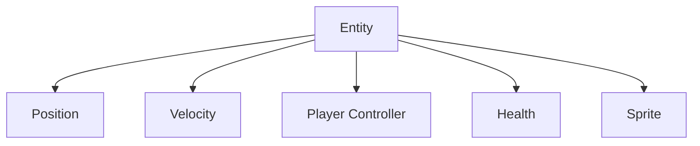

# Getting Started

Frent is on [Nuget](https://www.nuget.org/packages/Frent/)!

> [!CAUTION]
> Frent is still in beta.

```pwsh
dotnet add package Frent --version 0.5.4-beta
```

*Note: You will need to enable prerelease to see the package in many UIs.*
*Note: Unity requires a [different package](https://itsbuggingme.github.io/Frent/docs/unity.html)*

## Creating a World
Start by importing `Frent` and `Frent.Components` (for component interfaces).
```csharp
using Frent;
using Frent.Components;
```
To create a world, simply use its constructor
```csharp
World world = new World(); 
```
A world is a collection of entities, and entities are made of components. Components can be almost any datatype, although its recommended to use structs.

Consider a player entity with the following components.

Here, the `Velocity` component might interact with the `Position` component, and the `PlayerController` component might interact with the `Velocity` component when the W key is pressed.

Here is an example `Position` component - it just needs to specify enough data for a location.
```csharp
struct Position(int x, int y)
{
    public int X = x;
    public int Y = y;
}
```
Here is an example `Velocity` component. By implementing the `IComponent<Position>` interface, we tell Frent that this `Velocity` struct is a component which interacts with its entity's `Position` and so needs it as an argument in its update method.
```csharp
struct Velocity(int dx, int dy) : IComponent<Position>
{
    public int DX = dx;
    public int DY = dy;
    public void Update(ref Position pos)
    {
        pos.X += DX;
        pos.Y += DY;
    }
}
```
Let's make one last component to draw things to the console.
```csharp
struct Character(char c) : IComponent<Position>
{
    public char Char = c;
    public void Update(ref Position pos)
    {
        Console.SetCursorPosition(pos.X, pos.Y);
        Console.Write(Char);
    }
}
```
To use these components, we must create an entity with them using the world.
```csharp
//create
Entity entity = world.Create<Position, Velocity, Character>(new(4, 6), new(2, 0), new('@'));

//simulate 20 frames
for(int i = 0; i < 20; i++)
{
    world.Update();
    Thread.Sleep(100);
    Console.Clear();
}

Position finalPos = entity.Get<Position>();
Console.WriteLine($"Position: X: {finalPos.X} Y: {finalPos.Y}");
```
And that's it! You've got the basics of Frent.
For more information about entities, systems, uniforms, and filtering world updates, check out the [cookbook](https://itsbuggingme.github.io/Frent/cookbook/component-composition.html)!

*Full Code Sample*
```csharp
using System;
using System.Threading;
using Frent;
using Frent.Components;

World world = new World();

//create
Entity entity = world.Create<Position, Velocity, Character>(new(4, 6), new(2, 0), new('@'));

//simulate 20 frames
for (int i = 0; i < 20; i++)
{
    world.Update();
    Thread.Sleep(100);
    Console.Clear();
}

Position finalPos = entity.Get<Position>();
Console.WriteLine($"Position: X: {finalPos.X} Y: {finalPos.Y}");

struct Position(int x, int y)
{
    public int X = x;
    public int Y = y;
}

struct Velocity(int dx, int dy) : IComponent<Position>
{
    public int DX = dx;
    public int DY = dy;
    public void Update(ref Position pos)
    {
        pos.X += DX;
        pos.Y += DY;
    }
}

struct Character(char c) : IComponent<Position>
{
    public char Char = c;
    public void Update(ref Position pos)
    {
        Console.SetCursorPosition(pos.X, pos.Y);
        Console.Write(Char);
    }
}
```
