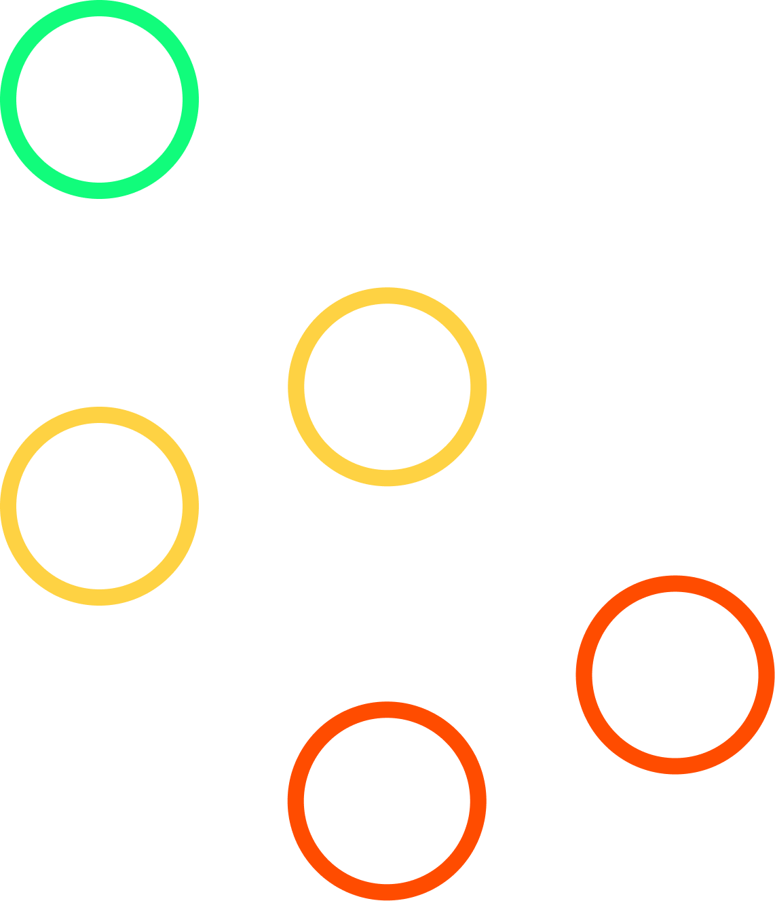

# Links (relationships)

Links let you build a directed graph where you connect entities with links.



For example, the following code could be used to build the graph above:

```cs
World world = new();
Entity a = world.Create();

Entity b = world.Create();
Entity c = world.Create();

Entity d = world.Create();
Entity e = world.Create();

a.Link<ChildOf>(b);
a.Link<ChildOf>(c);

c.Link<ChildOf>(d);
c.Link<ChildOf>(e);

foreach (Entity child in a.EnumerateOutgoingWithEntities<ChildOf>())
{
    // gets you b, c
}

struct ChildOf;
```